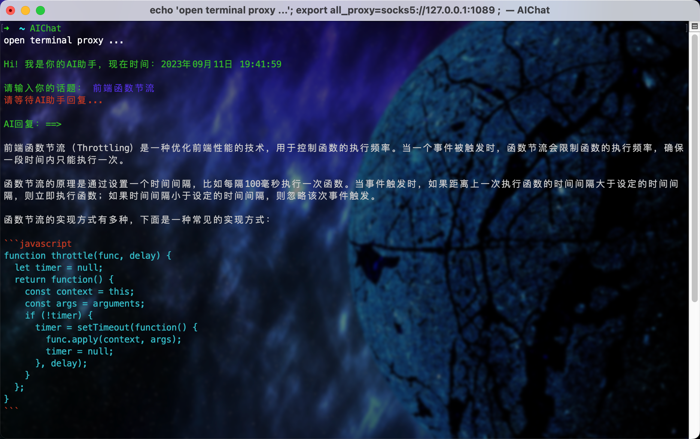

## AI工具

## TerminalAIChat

> 一款在命令行终端运行的GPTChat工具，用户输入，OpenAI输出。
- 支持输出文本格式化显示
- 支持输出的代码高亮显示
- 支持报错提示
- 人机交互灵活
- 工具在未压缩下8kb左右
- 凡是支持Shell语言的终端皆能运行
- 启动简单，仅需输入一个`AIChat`指令即可

- [TerminalAIChat简介](./TerminalAIChat/README.md)
- [TerminalAIChat下载](./TerminalAIChat)
