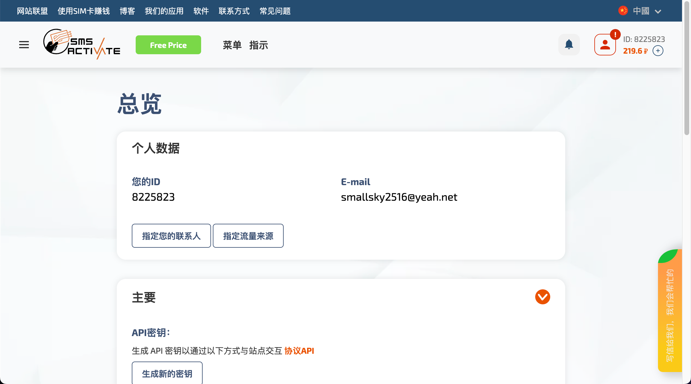
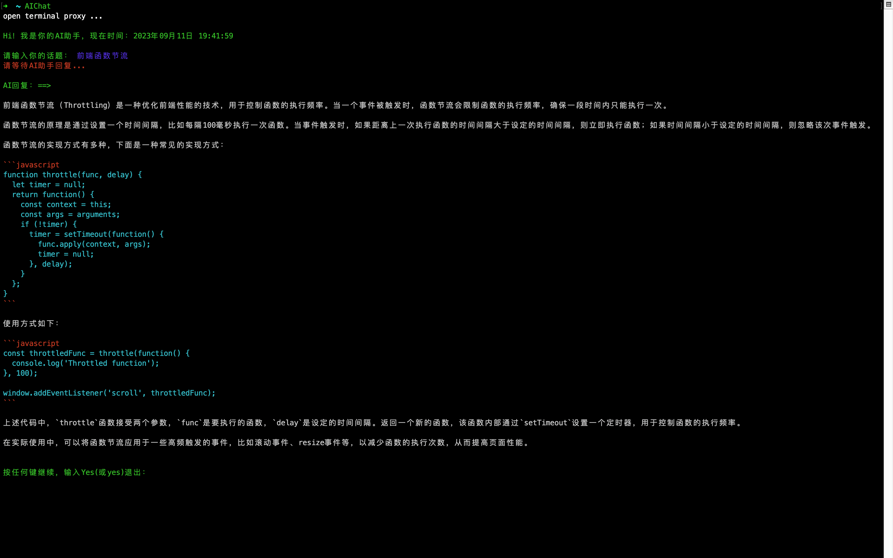

# TerminalAIChat

> 一款在命令行终端运行的GPTChat工具，用户输入，OpenAI输出。

- 支持输出文本格式化显示

- 支持输出的代码高亮显示

- 支持报错提示

- 人机交互灵活

- 工具在未压缩下8kb左右

- 凡是支持Shell语言的终端皆能运行

- 启动简单，仅需输入一个`AIChat`指令即可


仅需能科学上网，能访问[OpenAI官网](https://openai.com/)，以及有一个有效的`API KEY`。


**如何科学上网**：大家都懂，不知道可以去网上搜搜，推荐自己用的一款**[V2ray](https://github.com/Qv2ray/Qv2ray)**工具，需要找节点。

**如何有一个自己的`APP KEY`**：功夫不负有心，只要肯下功夫，该有的只是时间问题。下面提供了一种方案，已经亲自下过水。


现今[OpenAI官网](https://openai.com/)，已经关闭：**中国**、俄罗斯联邦、意大利等多个国家账号的注册和登录。在能科学上网的前提下，国内用户可以[租借国外虚拟手机号](https://sms-activate.org/cn)，短信验证登录，花费不足十元。如何租借虚拟手机号，可以看头条提供的[解决方案](https://www.toutiao.com/article/7188819215145763328/?wid=1694355182691)。




## 环境搭建

- 安装`curl`，版本不限，不要太低。（**Mac**推荐**brew**安装）

  ```shell
  # brew 安装
  brew install curl;
  ```

  [curl官网安装](https://curl.se/download.html)

### **Mac**

```shell
# 若是Bash，则打开终端，输入
open ~/.bash_profile
# 若是zsh，则打开终端，输入
open ~/.zshrc

# OpenAI
# API Key
export OpenAI_API_KEY="你的API KEY";
# gptchatCache.json文件输出地址（可选配置）
export OpenAI_OutputFile="你想输出文件夹/gptchatCache.json";
# 开启AIChat快捷指令
alias AIChat="TerminalAIChat放入的文件夹/AIChat.sh "

# 保存，并在终端输入以下命令，让之生效
# 若是Bash，则打开终端，输入
source ~/.bash_profile
# 若是zsh，则打开终端，输入
source ~/.zshrc
```

​	测试时，**终端也需要启动代理**（终端代理是独立于系统的）。

```shell
# 配置终端代理
alias proxy="echo 'open terminal proxy ...';export all_proxy=socks5://127.0.0.1:1089;"
alias unproxy="echo 'close terminal proxy!';unset all_proxy;"

# 推荐：这样设置AIChat快捷指令
alias AIChat="proxy;TerminalAIChat放入的文件夹/AIChat.sh "
# 配置好后依然需要保存，并source让环境马上在终端生效，往上看
```

### **Windows**

可以到网上检索下：**环境变量**+**终端快捷指令** 配置（身边没有WIndows电脑）。步骤是一样的，配置环境变量的名字一致即可。


整个操作效果，可以看这：



**会持续的迭代优化，增加新功能**： 
-  优化代码语法高亮显示，拓展成终端语法高亮插件。
-  结合NodeJS封装成脚手架，减少使用者配置。
-  更换国内OpenAI服务请求，解决因网络无法使用，AI回复慢。
-  ......

